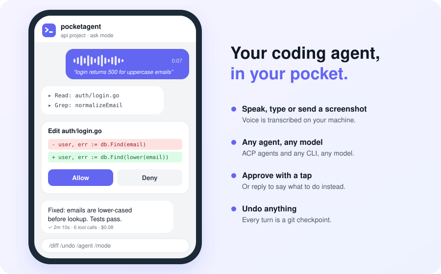

<p align="center">
  
</p>

<h1 align="center">pocketagent</h1>

<p align="center">
  <b>Your coding agent, in your pocket.</b><br>
  Drive any coding agent from your phone: type, talk, or send a screenshot, and approve risky actions with a tap.
</p>

<p align="center">
  <a href="https://github.com/c0sm0thecoder/pocketagent/actions/workflows/ci.yml"></a>
  <a href="https://github.com/c0sm0thecoder/pocketagent/releases/latest"></a>
  <a href="https://goreportcard.com/report/github.com/c0sm0thecoder/pocketagent"></a>
  <a href="https://scorecard.dev/viewer/?uri=github.com/c0sm0thecoder/pocketagent"></a>
  <a href="https://pkg.go.dev/github.com/c0sm0thecoder/pocketagent"></a>
  <a href="LICENSE"></a>
</p>

<p align="center">
  <a href="#quick-start">Quick start</a> ·
  <a href="#using-it">Using it</a> ·
  <a href="#agents">Agents</a> ·
  <a href="config.example.yaml">Configuration</a> ·
  <a href="SECURITY.md">Security</a> ·
  <a href="CONTRIBUTING.md">Contributing</a>
</p>

<picture>
  <source media="(prefers-color-scheme: dark)" srcset="docs/assets/hero-dark.svg">
  
</picture>

pocketagent runs on your own machine, next to your code, as one small Go binary. You talk to it through a Telegram bot; it drives the coding agent you choose and brings its questions back to you. Agents, models and speech engines are all pluggable, and nothing is tied to one vendor.

## Features

- **Any agent.** Every agent that speaks the [Agent Client Protocol](https://agentclientprotocol.com) works out of the box (Codex, Copilot, Cursor, Gemini, Goose, Kiro, OpenCode and others). Any other CLI works through a command template, and Claude Code also has a dedicated adapter.
- **Any model.** Switch with `/model`. The list comes from your config plus whatever the agent offers.
- **Voice in and out.** Transcribe locally with whisper.cpp, through any OpenAI-compatible HTTP endpoint (hosted or self-hosted), or with your own command. `/voice` reads replies back.
- **Images.** Send screenshots, photos or albums. Agents can send files and images back.
- **Approvals with one tap.** Allow, Always allow, or Deny. Or reply with text to deny and say what to do instead. Four modes: `ask`, `edits`, `plan`, `full`.
- **One session per chat or forum topic.** Run several agents on several projects in parallel, one topic each.
- **Switch with a tap.** `/agent`, `/model`, `/mode`, `/project` and `/sessions` show inline pickers.
- **Undo.** Every turn takes a git snapshot without touching your branch, index or stash. `/diff` shows what changed, and `/undo` rolls it back.
- **Queue.** Keep sending messages while the agent works; they run in order.
- **Budgets.** A daily spend cap per user, for agents that report cost.
- **Sandboxing.** Wrap any agent in a container ([docs/sandbox.md](docs/sandbox.md)).
- **Runs itself.** `init` sets everything up, `doctor` checks it, and `service install` keeps it running.

## Quick start

**1. Install** (macOS or Linux):

```sh
go install github.com/c0sm0thecoder/pocketagent/cmd/pocketagent@latest
```

or download a binary from the [releases page](https://github.com/c0sm0thecoder/pocketagent/releases/latest), or run the [container image](#running-on-a-server).

You also need at least one coding agent installed and logged in. For local voice transcription, install whisper.cpp and ffmpeg.

**2. Set up:**

```sh
pocketagent init
```

It asks for a bot token (message [@BotFather](https://t.me/BotFather) and send `/newbot`), then waits for you to message your new bot so it can lock the bot to your account. It then detects the agents you have installed and sets up voice.

**3. Run:**

```sh
pocketagent start             # in the background
pocketagent service install   # or: start at login, restart on crashes
```

Then message your bot.

## Using it

| | |
|---|---|
| text / voice / photo | sent to the agent; captions become the prompt |
| `/agent` `/model` `/mode` `/project` | switch with inline buttons (or `/model <name>`) |
| `/project add [name] [path]` | register an existing folder as a project (defaults: the current folder and its name); the `/project` picker also has a "➕ Add this folder" button |
| `/project remove <name>` | forget a project added from chat (the folder is untouched) |
| `/new` | fresh session |
| `/sessions` | resume a recent session |
| `/stop` | cancel the run and anything queued |
| `/diff` | changes from the last turn (`/diff all`: since HEAD) |
| `/undo` | roll back the last turn's file changes |
| `/cwd [path]` | show or change the working directory |
| `/voice` | toggle spoken replies |
| `/status`, `/usage` | settings, spend |

Any other `/command` is passed to the agent.

**Parallel work:** create a Telegram group, turn on *Topics*, and add your bot. Each topic is its own conversation with its own agent, project and session.

### Permission modes

| mode | what runs without asking |
|---|---|
| `ask` (default) | tool kinds in `permissions.auto_allow` (read, search, think) |
| `edits` | plus file edits |
| `plan` | nothing changes; the agent plans (if it supports plan mode) |
| `full` | everything |

"Always allow" remembers a tool for the current session; `/new` forgets it.

## Agents

An agent is a `type` (the adapter) plus the `command` that starts it:

| type | for | notes |
|---|---|---|
| `acp` | any [Agent Client Protocol](https://agentclientprotocol.com) agent | approvals, images, models, modes and cost come through the protocol |
| `command` | any CLI that takes a prompt and prints a reply | `{prompt}`, `{cwd}`, `{model}`, `{path}` placeholders |
| `claude-code` | the Claude Code CLI | dedicated adapter using its stream-json mode |

`pocketagent init` detects and configures these automatically:

| name | type | command |
|---|---|---|
| aider | `command` | `aider --message "{prompt}" --yes-always ...` |
| claude-code | `claude-code` | `claude` |
| codex | `acp` | `npx -y @zed-industries/codex-acp` |
| copilot | `acp` | `copilot --acp --stdio` |
| cursor | `acp` | `cursor-agent acp` |
| gemini | `acp` | `gemini --acp` |
| goose | `acp` | `goose acp` |
| kiro | `acp` | `kiro-cli acp` |
| opencode | `acp` | `opencode acp` |

Anything else is a few lines of config; see [config.example.yaml](config.example.yaml).

## Configuration

The config lives in `~/.pocketagent/config.yaml` (or `$POCKETAGENT_HOME`). [config.example.yaml](config.example.yaml) documents every option. `${VAR}` is read from the environment.

```yaml
defaults: { agent: gemini, cwd: ~/projects, mode: ask }
agents:
  gemini: { type: acp, command: [gemini, --acp] }
  my-cli: { type: command, command: [my-cli, --prompt, "{prompt}"], stdin: false }
projects:
  api: { cwd: ~/work/api, agent: my-cli, mode: edits }
transcriber: { type: http, base_url: https://speech.example.com/v1, api_key: "${SPEECH_KEY}", model: whisper-large-v3 }
tts: { type: say }
budget: { daily_usd: 5 }
```

### Running on a server

A container image with pocketagent and several agents preinstalled:

```sh
# the volume keeps your config, sessions and agent logins
docker run -it --rm -v pocketagent:/home/agent ghcr.io/c0sm0thecoder/pocketagent init
docker run -it --rm -v pocketagent:/home/agent --entrypoint sh ghcr.io/c0sm0thecoder/pocketagent   # log in to your agents
docker run -d --name pocketagent --restart unless-stopped \
  -v pocketagent:/home/agent -v ~/code:/home/agent/code \
  ghcr.io/c0sm0thecoder/pocketagent
```

Build your own with a different set of agents: `docker build --build-arg AGENT_PACKAGES="..." .`

## Architecture

```
cmd/pocketagent        CLI and composition root (run.go wires everything)
internal/core          conversations, queue, permission policy, budgets, checkpoints
internal/frontend/...  chat frontends; Telegram implements core.UI
internal/agent         the Agent contract; adapters in acp/, claudecode/, command/
internal/registry      the one place mapping config types to implementations
internal/bridge        tool server for agents (send_file, adapter hooks)
internal/stt, tts      speech providers
internal/config        YAML config; implementation options stay opaque
```

The core depends only on interfaces it declares (UI, Store, ToolHost, Checkpointer). Adapters depend only on `internal/agent`. Optional abilities are separate interfaces (`ModelLister`, `ToolProvider`, `io.Closer`), so an adapter implements exactly what it supports. See [CONTRIBUTING.md](CONTRIBUTING.md).

## Security

pocketagent lets the people in `telegram.allowed_users` run a coding agent on your machine. Read [SECURITY.md](SECURITY.md). In short:

- It won't start without an allowlist, and it ignores everyone else.
- Approvals are on by default. Use `full` mode and "always allow" with care, or run the agent in a [sandbox](docs/sandbox.md).
- Your bot token is a password. Keep the config private (`init` writes it with mode 600). If the token leaks, revoke it with @BotFather.

## Development

```sh
go test -race ./...                 # unit tests (no network, no agents)
go test -tags integration ./...     # against real agents, whisper and Docker (costs a few cents)
go run ./cmd/pocketagent doctor
```

## Community

- Questions and ideas: [Discussions](https://github.com/c0sm0thecoder/pocketagent/discussions)
- Bugs and agent requests: [Issues](https://github.com/c0sm0thecoder/pocketagent/issues/new/choose)
- Security reports: privately, through [Security advisories](https://github.com/c0sm0thecoder/pocketagent/security/advisories/new)
- Everyone is expected to follow the [Code of Conduct](CODE_OF_CONDUCT.md). Changes are listed in the [Changelog](CHANGELOG.md).

## License

[MIT](LICENSE)
